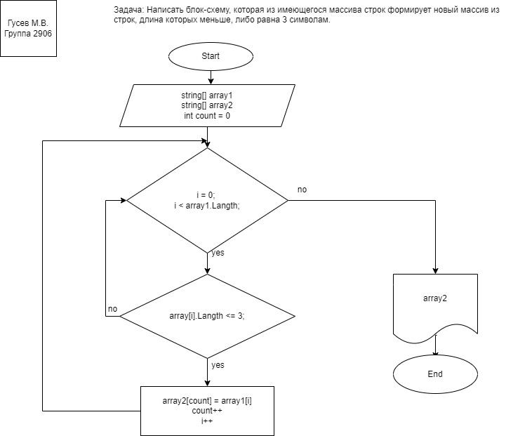

**Задача :**

Написать программу, которая из имеющегося массива строк формирует массив из строк, длина которых меньше либо равна 3 символа. Первоначальный массив можно ввести с клавиатуры, либо задать на старте выполнения алгоритма. При решение не рекомендуется пользоваться коллекциями, лучше обойтись исключительно массивами

**Описание алгоритма решения:**

1. Объявляем и инициализируем массив "array"с типом данных "string" 

2. Объявляем массив "newArray",  задаем размер (длину) массива, равную первому newArray = new string[array.Length].

3. Создаем void метод с двумя аргументами, в качестве которых выступают вышеуказанные массивы. Метод формирует из имеющегося массива строк  новый массив из строк, длина которых меньше, либо равна 3 символам. 
Используя переменную count (которая на этапе объявления равна 0) и цикл for(int i = 0; i < array1.Length; i++) наш метод проверяет условие if(array1[i].Length <= 3): если элемент масиива array с индексом [i], размера Langth, меньше или равен трем (в данном случае символам), тогда выполняется действие (операция присваивания) array2[count] = array1[i], где переменная count служит неким контейнером записи на каждщй итерации цикла.

4. Результатом работы метода является вывод значений элементов массива, состоящих из строк, длина которых меньше либо равна 3 символам.

5. Для вывода результата в консоль используем метод void PrintArray(), в качестве аргумента передаем наш массив состоящий из строк, длина которых меньше либо равна 3 символам.